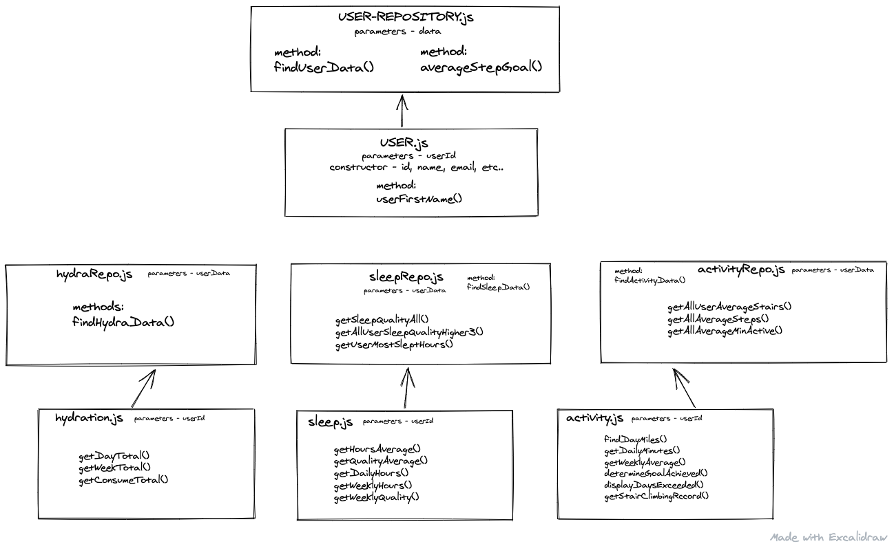

# fitZen - Health Tracker
### Turing School of Software Design - Mod2 Paired project

### Contributors
- Jeff Kersting : [github profile](https://github.com/JeffKersting)
- Kevin Hartmann : [github profile](https://github.com/kevinhartmann23)

The details of this project are outline in [this project spec](http://frontend.turing.io/projects/fitlit.html).

## Table of Contents
1. [Introduction](#introduction)
2. [Instructions](#setup-instructions)
3. [How-To](#using-fitzen)
4. [Challenges & Wins](#challenges-&-wins)
5. [Appreciation](#appreciation)

## Introduction
  The task was to build an app that tracks a user's health information. Given the data forms, we created a single page view where you can filter through a user's hydration, activity, and sleep data. We have also included a friends sidebar that allows a user to remain up to date with their friends activities for extra encouragement! Please follow the [setup instructions](#setup-instructions) below on how to begin!

## Setup Instructions

- For easy use and access visit our deployed site [here]()

If you are interested in browsing our code or contributing, follow the steps below:
  1. Fork this repo - on the top right corner of this page, click the **Fork** button.
  2. Once forked, `git clone [ssh key]` in your terminal, to add this repo locally.
  3. Run `npm install` to install all of this projects dependencies.

[Back to Top of Page](#table-of-contents)

### Testing

We have created a series of tests for our data model. If you would like to run a few of these tests, choose a test file and run `npm test test/[selected test file]` in your terminal.
You will see that we have provided a set test data file to make testing much smoother and easier to read.

### Linting Your Code

Run the command in your terminal `npm run lint` to run the linter on your JavaScript code.

The linter will look only at the JavaScript files you have within the `src` and the `test` directories.

### Data Model

We have decided to break our data model down into 2 files for each category: our `repos` will consist of any data and method needed to compile data for **all** users. Then, individual data `user` files to compile data based on a single user.

Below is a layout of our data architecture:

You will also find we added a few other files to create a better user experience!
- `chartHelpers.js` - using a additional dependency we built charts to display user information
- `friend.js` - adding a friend file, allowed us to gather a user's friend information based on the filtered data
- `dataHelpers.js` - dataHelpers streamlined our `script.js` adding `htmlData` objects to store page information allowed us to interpolate a single page with selected information.
- `domHelpers.js` - domHelpers works along side `script.js` and `dataHelpers` to streamline DOM manipulation

### Technologies Used
- javascript
- HTML
- CSS
- github & github projects
- charts.js
- TDD
- linter
- icon8.com (image/vector/icon reference)

[Back to Top of Page](#table-of-contents)

## Using fitZen

#### Login Page
On page load, you are greeted by a login page. This is currently designed to enter a given name from the user's data file. Typing a user's name, then clicking the login button will allow a user access to their information. We have added a few extra features, allowing a user to enter their name in any form (uppercase, lowercase, etc), and providing an alert if the user's full name is not recognized.
------ INSERT IMAGE/GIF HERE ----------
Future Iterations:
- Usernames and Passwords: _adding a unique username to our data, and allow a user to enter a password for user security._
- Create an account: _allowing new user's to input their user information as a new user._

#### Navigation Bar
The navigation bar will remain along all sections of the page, its functionality and icons vary based on the page the user is currently viewing:
- Login Page: _no icons available_
- Main Page: _**icons** for filtering each data page, a **calendar** to change the date of the data a user is viewing, **hamburger menu** for a user to view their account information or logout_
- Data Pages: _all icons above, with an additional smaller **fitZen mascot** which allows you to return to your main page._
------ INSERT IMAGE/GIF HERE ----------

#### Welcome Page
Once a user has logged in, the main page displays fitZen's meditating mascot! The bubbles surrounded by the fitZen mascot are populated with a **water glass** representing a user's hydration, a **running shoe** representing a user's activity, and a **bed** representing a user's sleep. You can also find smaller icons in the top right corner of the window for quick access and filtration of data.
------ INSERT IMAGE/GIF HERE ----------
Future Iterations:
- TBD

#### Filtering Data
On click of any icon, the icon will change colors and the window will populate data a user is choosing to view. The will see a **friends section** displaying all of the user's friends, and their data based on chosen view. On the main area of the page the user will see **3 widgets** displaying data specific to the data requested, and a **bar graph** displaying a week view of the specific data.
------ INSERT IMAGE/GIF HERE ----------
Future Iterations:
- User Profile Pictures: _allow each user to upload an image for their profile picture, each user's friends would populate their profile picture in place of the icon, setting the icon to a default._
- Exploring Donut Graphs: _Adding donut graphs as a border around each image to show the user how close they are to achieving their goals._

#### User Account Information
At the very top right there is a small menu icon, when a user hover's over this icon they are give the option to view their information or logout! Selecting `Account` will display a user info card to show the user their given information: **id, name, email address, address, goals, and friends!**
------ INSERT IMAGE/GIF HERE ----------
Future Iteration:
- Update Information: _add an edit feature to user's information for more accurate data display and better user experience._

[Back to Top of Page](#table-of-contents)

## Challenges & Wins

### Challenges
- Time management: it's easy to focus all of our time on our project, and we did. Learning to delegate and separate time for other homework or practice could have helped us outside of our project scope.
- Grid Scaling and Sizing Chart.js: introducing charts.js was a lot to take on but we studied up and got it to work.

### Wins/Reflections
- Responsiveness! We took some time to dive into Responsiveness and we are glad we did.
- Data Model & DOM: taking the time to really think and plan these out made a huge difference, it allowed us to get ahead of the game in the long run and focus on features and issues we may not have thought we would have the time for.
- Planning: using github projects to the fullest (issues, milestones, etc), really kept us on top of what to do and where to start.
- Communication: We worked extremely well together, and had fun doing it.

[Back to Top of Page](#table-of-contents)
